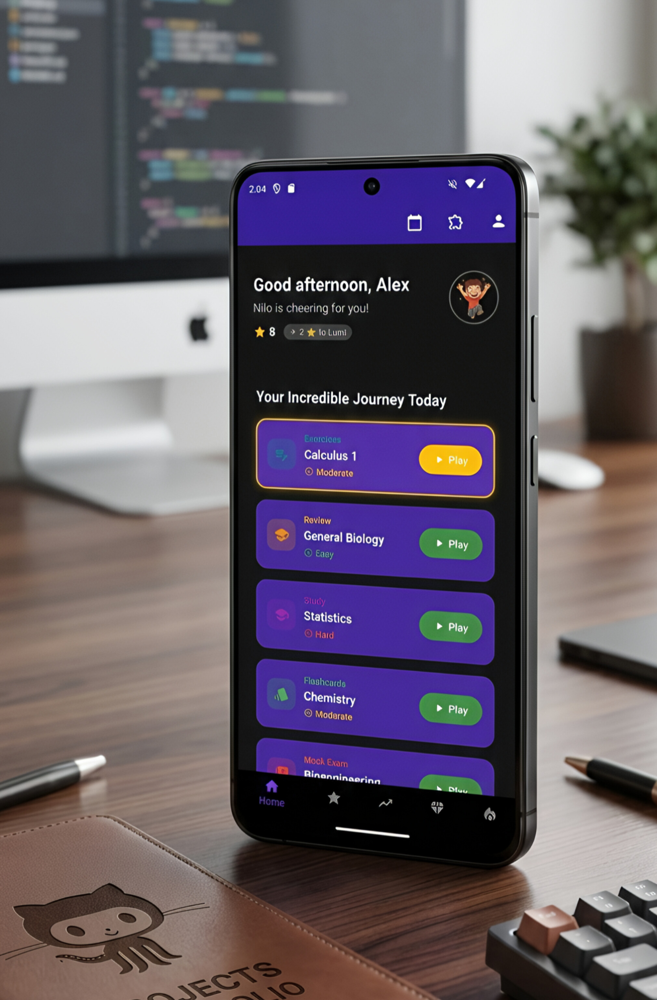
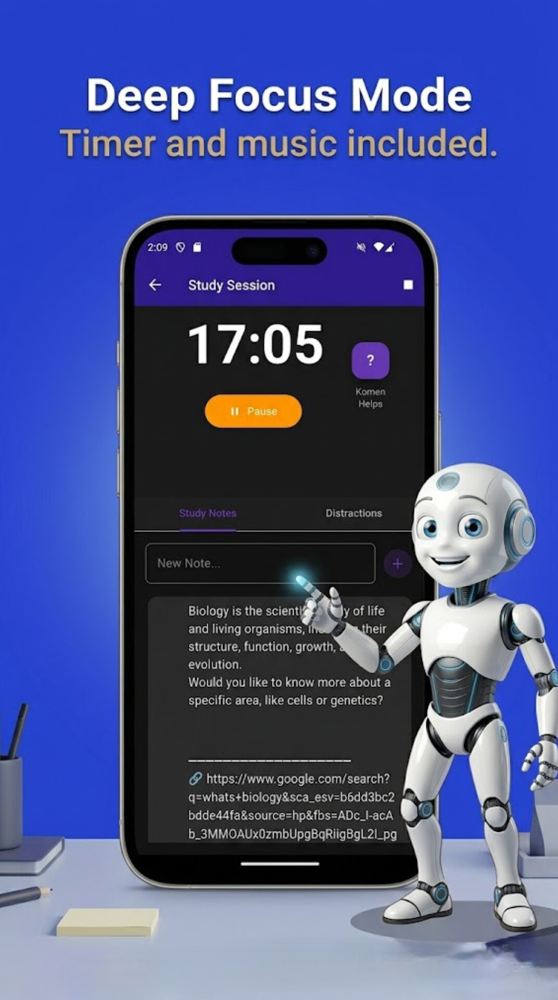
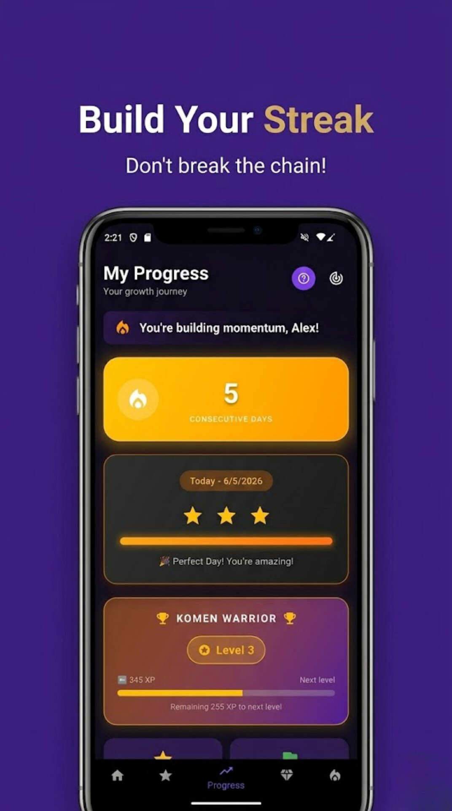

# Komen: The Intelligent Study Assistant

> **Note on repository visibility:** Komen is an actively developed commercial product. To protect intellectual property, the source code is kept private. This repository serves as a technical showcase, documenting the system architecture, engineering decisions, and the development journey behind the application.

---

## Download & Try Komen

The application is currently available for Android devices. Experience the gamified study flow firsthand by downloading it directly from the Google Play Store:

<a href="https://play.google.com/store/apps/details?id=com.gotagames.komen" target="_blank">
  
</a>

---
## The Vision

Studying is often treated as a test of endurance. Students struggle with organization, lose motivation over time, and rarely get immediate, personalized feedback on their progress. Traditional methods are repetitive and disconnected from how modern learning actually works.

I built Komen to change that dynamic. It is not just another task manager. Komen bridges the gap between artificial intelligence, study management, and gamification to create an ecosystem where students actually want to learn. It handles the heavy lifting of routine organization, generates tailored quizzes on the fly, evaluates answers using AI, and—most importantly—works perfectly offline.


---

### Product Screenshots

<p align="center">
  
  
  
</p>

## Under the Hood

To deliver a seamless, cross-platform experience with complex backend requirements, I chose a modern and highly scalable stack:

* **Frontend:** Flutter & Dart (Focusing on a fluid, 60fps user interface)
* **Backend API:** FastAPI & Python (Handling complex business logic and AI processing)
* **Database:** Supabase / PostgreSQL (Relational data modeling and scalability)
* **Authentication:** Firebase Authentication (Secure, frictionless user access)

### System Architecture

Instead of connecting the mobile app directly to the database, I implemented a decoupled architecture. The Flutter client communicates exclusively with the FastAPI backend, which acts as the single source of truth for business rules, data validation, and AI service integration before interacting with Supabase.

```text
Mobile Client (Flutter) 
      │
      ▼ (RESTful API Requests)
Backend Service (FastAPI) 
      │
      ▼ (Data Validation & Business Logic)
Database & Storage (Supabase)

```

---

## The Engineering Journey: Challenges & Solutions

Building Komen was a massive undertaking in system design. Transitioning from theoretical concepts to a production-ready application required solving several complex engineering hurdles.

### 1. The Offline-First Reality

Students don't always have reliable internet access, so requiring a constant connection was a dealbreaker. I designed an offline-first architecture where data is stored and managed locally on the device. The challenge was building a custom synchronization engine. Whenever connectivity is restored, the app intelligently syncs the local cache with the FastAPI backend, resolving conflicts and ensuring data consistency without interrupting the user experience.

### 2. Taming the AI Integration

Integrating AI features—like dynamic quiz generation and answer evaluation—was not just about making API calls. The real challenge was performance and UX. AI generation takes time, so I had to design backend endpoints that process these requests efficiently, implement timeouts, and handle potential network failures gracefully so the app never feels unresponsive.

### 3. State Management and UI Performance

As the app grew to include study diaries, progress tracking, and gamified elements, managing the state across dozens of screens became complex. I structured the Flutter project using clean architecture principles, separating the UI from the domain and data layers. This kept the codebase maintainable, allowed for reusable components, and ensured the UI remained highly responsive.

### 4. Database Modeling for the Future

Designing the Supabase schema required forward-thinking. I had to model relations for users, study sessions, dynamic AI content, and progress tracking in a way that remains performant today but is flexible enough to support future features like learning analytics and team collaboration.

### System Architecture Diagram

### System Architecture Diagram

![System Architecture Diagram](https://quickchart.io/mermaid?chart=graph%20TD%0A%20%20%20%20classDef%20client%20fill:%23f9f9f9,stroke:%23333,stroke-width:2px;%0A%20%20%20%20classDef%20backend%20fill:%23e1f5fe,stroke:%230288d1,stroke-width:2px;%0A%20%20%20%20classDef%20storage%20fill:%23efebe9,stroke:%235d4037,stroke-width:2px;%0A%20%20%20%20classDef%20external%20fill:%23ede7f6,stroke:%235e35b1,stroke-width:2px;%0A%0A%20%20%20%20subgraph%20Mobile_Client%20%5BMobile%20Client%20-%20Flutter%5D%0A%20%20%20%20%20%20%20%20UI%5BFlutter%20UI%20/%20Widgets%5D%0A%20%20%20%20%20%20%20%20Sync%5BSync%20Engine%5D%0A%20%20%20%20%20%20%20%20Cache%5B%28Local%20SQLite%20%26%20Shared%20Preferences%29%5D%0A%20%20%20%20end%0A%20%20%20%20class%20Mobile_Client,UI,Sync,Cache%20client;%0A%0A%20%20%20%20subgraph%20Backend_Services%20%5BBackend%20Architecture%20-%20FastAPI%5D%0A%20%20%20%20%20%20%20%20Auth%5BAuth%20Verification%20Engine%5D%0A%20%20%20%20%20%20%20%20Router%5BREST%20Endpoints%5D%0A%20%20%20%20%20%20%20%20JSONParser%5BJSON%20Response%20Standardizer%5D%0A%20%20%20%20end%0A%20%20%20%20class%20Backend_Services,Auth,Router,JSONParser%20backend;%0A%0A%20%20%20%20subgraph%20Data_Cloud%20%5BCloud%20%26%20Data%20Layer%5D%0A%20%20%20%20%20%20%20%20Supa%5B%28Supabase%20/%20PostgreSQL%29%5D%0A%20%20%20%20end%0A%20%20%20%20subgraph%20AI_Cloud%20%5BExternal%20Services%5D%0A%20%20%20%20%20%20%20%20OpenAI%5BAI%20Provider%20API%5D%0A%20%20%20%20end%0A%20%20%20%20class%20Data_Cloud,Supa%20storage;%0A%20%20%20%20class%20AI_Cloud,OpenAI%20external;%0A%0A%20%20%20%20UI%20--%3E%7C1.%20Triggers%20Action%7C%20Sync%0A%20%20%20%20Sync%20%3C--%3E%7C2.%20Read/Write%20Local%20Cache%7C%20Cache%0A%20%20%20%20Sync%20%3D%3D%3E%7C3.%20HTTPS%20Request%20with%20Auth%20token%7C%20Auth%0A%20%20%20%20Auth%20--%3E%20Router%0A%20%20%20%20Router%20%3C--%3E%7C4.%20Database%20Operations%7C%20Supa%0A%20%20%20%20Router%20%3D%3D%3E%7C5.%20Text%20Prompt%20Processing%7C%20OpenAI%0A%20%20%20%20OpenAI%20%3D%3D%3E%7C6.%20Raw%20AI%20Response%7C%20JSONParser%0A%20%20%20%20JSONParser%20%3D%3D%3E%7C7.%20Structured%20JSON%20Payload%7C%20Router%0A%20%20%20%20Router%20%3D%3D%3E%7C8.%20HTTPS%20Secure%20Response%7C%20Sync%0A%20%20%20%20Sync%20%3D%3D%3E%7C9.%20Dynamic%20Widget%20Building%7C%20UI)


### What's Next?

Komen is in active development. The current roadmap focuses on expanding the platform's reach and intelligence:

* **Web & Desktop Versions** for a unified cross-platform ecosystem.
* **Advanced AI Tutor** capabilities for deeper, conversational learning.
* **Learning Analytics** to provide students with data-driven insights into their study habits.

---

**Built by Denzel Gota**

Computer Engineering Student | Mozambique
